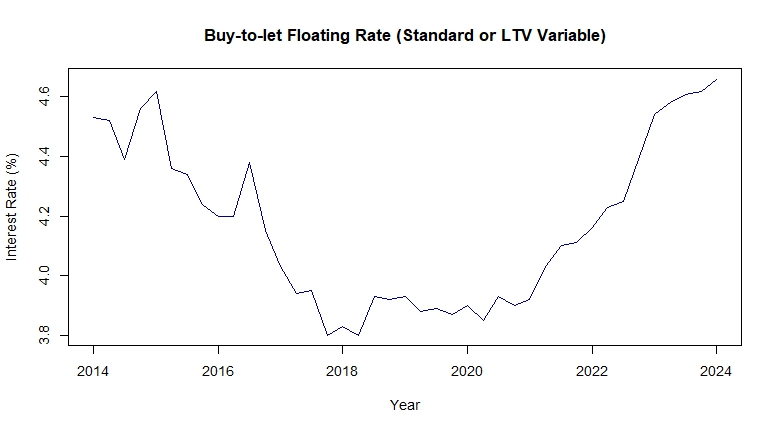
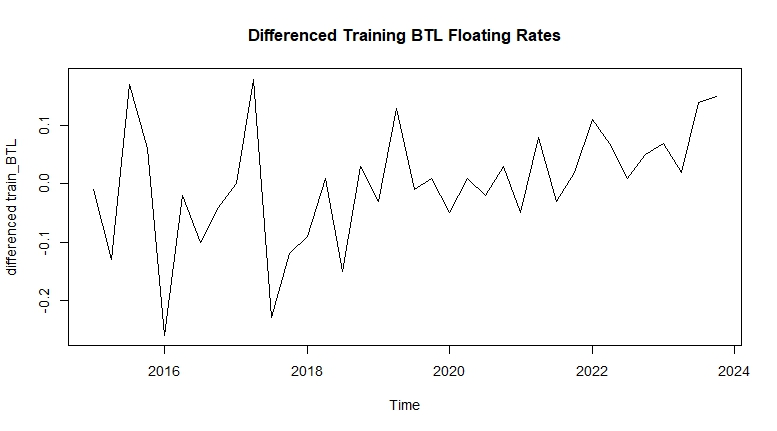
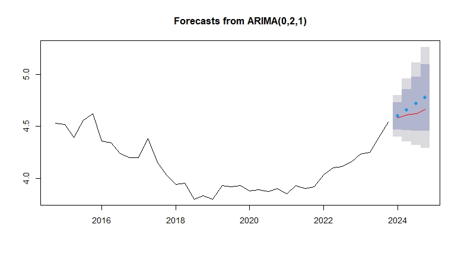
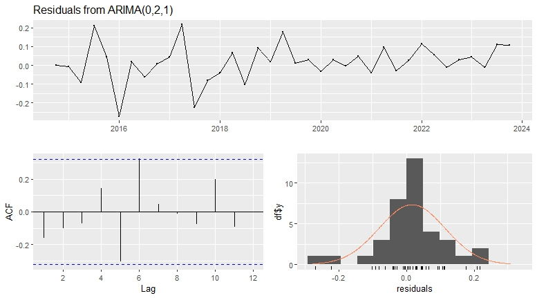

# Irish Mortgage Rate Forecasting

A time-series forecasting project analysing Irish buy-to-let floating mortgage rates using ARIMA models in R.

This project applies stationarity testing, autocorrelation analysis, differencing, ARIMA model selection, residual diagnostics, and out-of-sample forecasting to quarterly Irish mortgage rate data from 2014 to 2024.

## Project Overview

The project focuses on the following interest rate series:

**Buy-to-let properties, floating rate, standard or LTV variable, rates on outstanding amounts (%)**

The dataset contains quarterly observations from 2014 to 2024. The first 90% of observations were used for model building, while the final 10% were held out to compare forecasts against actual observed values.

## Objectives

- Convert quarterly mortgage rate data into a time-series object in R
- Assess whether the series is white noise or a random walk
- Test for stationarity using ACF, PACF, and Augmented Dickey-Fuller checks
- Apply differencing to achieve stationarity
- Fit and compare ARIMA models
- Analyse residuals using diagnostic plots and Ljung-Box testing
- Forecast future mortgage rates and compare forecasts against held-out observations

## Methods Used

- Time-series construction in R
- ACF and PACF analysis
- Augmented Dickey-Fuller testing
- First differencing
- Seasonal differencing checks
- ARIMA modelling
- Residual diagnostics
- Out-of-sample forecast comparison

## Models Considered

Two main ARIMA models were considered:

- ARIMA(1,1,0)
- ARIMA(0,2,1)

A seasonal ARIMA check was also performed because the data is quarterly. The seasonal model selected the same ARIMA(0,2,1) structure, suggesting that there was no strong seasonal component requiring separate seasonal AR or MA terms.

## Key Findings

The original mortgage rate series was non-stationary and showed clear autocorrelation structure. After differencing, the series became more suitable for ARIMA modelling.

The ARIMA(1,1,0) model produced a relatively flat forecast and did not capture the continued upward movement in the held-out 2024 observations as effectively.

The ARIMA(0,2,1) model performed better overall, capturing the upward trend more closely and producing stronger diagnostic results. Residual diagnostics suggested that the model captured most of the remaining structure in the series.

## Example Outputs

### Buy-to-let Floating Mortgage Rate Series



### Differenced Training Series



### Forecast from ARIMA(0,2,1)



### Residual Diagnostics for ARIMA(0,2,1)



## Repository Structure

```text
irish-mortgage-rate-forecasting/
├── docs/
│   └── time_series_assignment_report.pdf
├── outputs/
│   ├── acf_btl_floating_rates.jpeg
│   ├── pacf_btl_floating_rates.jpeg
│   ├── btl_floating_rates_timeseries.jpeg
│   ├── seasonal_acf.jpeg
│   ├── differenced_btl_floating_rates.jpeg
│   ├── acf_first_difference.jpeg
│   ├── pacf_first_difference.jpeg
│   ├── forecast_arima_110.jpeg
│   ├── forecast_arima_021.jpeg
│   ├── residuals_arima_110.jpeg
│   └── residuals_arima_021.jpeg
├── src/
│   └── mortgage_rate_forecasting.R
├── .gitignore
├── LICENSE
└── README.md
```
Tools and Libraries

- R
- readxl
- TSA
- dplyr
- tseries
- forecast

## Data Source

The data was sourced from the Irish Government open data portal:

Retail Interest Rates - Mortgage Rates
https://data.gov.ie/dataset/retail-interest-rates-mortgage-rates

The raw dataset is not included in this repository. The R script can be adapted to the local location of the downloaded dataset.

## Project Context

This project was completed as part of a university time-series analysis assignment and has been cleaned and organised for portfolio use.

## Disclaimer

This project is for educational and portfolio purposes only. It should not be used as financial advice or as a production forecasting tool.
